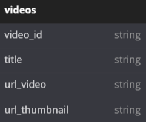
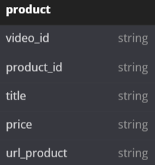
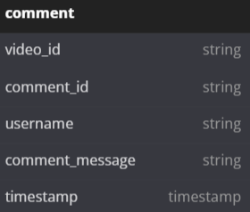

# Tokopedia Play Clone API

## Table Of Content
- [Database Schema](#database-schema)
- [API Documentation](#api-documentation)
- [LICENSE](#license)

## Database Schema

Tokopedia Play Clone Database Schema

  

## API Documentation

API documentation at [localhost:3000/docs/api](http://localhost:3000/docs/api)

## LICENSE

[MIT LICENSE](./LICENSE)