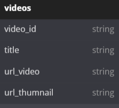
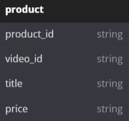
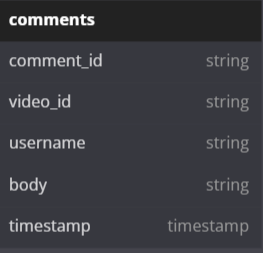

# Tokopedia Play Clone API

## Table Of Content
- [Database Schema](#database-schema)
- [Swagger](#swagger)
- [License](#license)

## Database Schema

Tokopedia Play Clone Database Schema

  

## Swagger

Swagger documentation api at [localhost:3000/docs/api](http://localhost:3000/docs/api)

## License

[MIT LICENSE](./LICENSE)